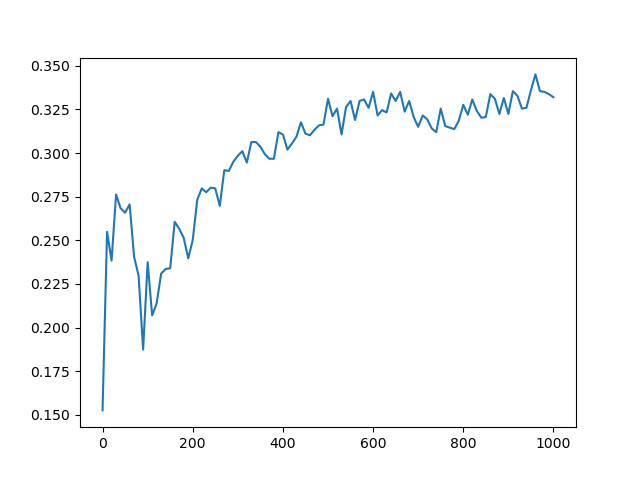

# CFGAN_with_Pytorch
A pytorch implementation of CFGAN, hope to help u😃😃
## requirements
- python3.7+
- pytorch
- numpy
- pandas
- matplotlib
- pandas

## run
the default dataset is movielens 100k, and u can self deal your dataset, like data_deal.deal_ml100k method in this project.
```
cd CFGAN_with_Pytorch
python main.py
```

## result
